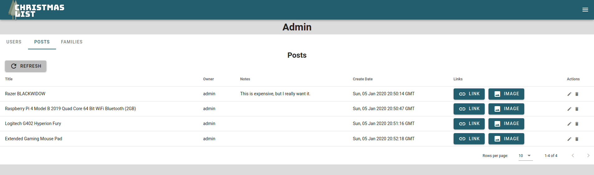

# Christmas List

This is an application to share christmas lists for friends and families.

## Motivation

This project was inspired by me wanting to learn more about Flask and Vue.js.

## Code Style

- Server side formatting was done with Black
- Client side formatting was done with prettier (see `client/prettierrc` for more info)

## Screenshots





## Tech/framworks used

- Flask
  - flask-login
  - flask-slqalchemy
- Vuejs
  - Vuetify

## Build instructions

```sh
# Build the client
cd client
npm install
npm run build
cd ..

# set up python environment
virtualenv -p python3 venv
source venv/bin/activate
pip install -r requirements.txt

# Run the server
flask run
```

## To Initialize DB

WARNING: when doing this, go into the .flaskenv file and change the `DB_SETUP` variable to 1. Once finished, change it back to 0.

```sh
flask db init
# then run upgrade commands
```

## To Upgrade DB

Whenever you change any of the models, these commands need to be run:

```sh
flask db migrate -m "<msg goes here>"
flask db upgrade
```

## License

MIT License

MIT © Gavin Fowler
